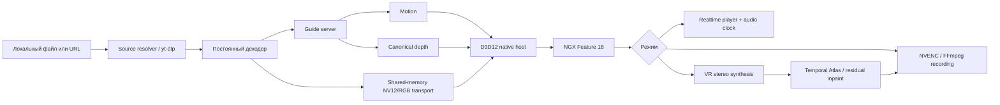

# DLSS5 Video Studio 22.3 — полная документация проекта

Статус документа: актуально для `22.3.0-rowflow-shared-depth` на 4 сентября 2026 года.

Этот файл — единая точка входа для пользователя, тестировщика и разработчика. Краткие заметки о конкретных релизах сохранены рядом с ним, но устройство программы, режимы, модели, форматы данных, сборка и диагностика описаны здесь.

## 1. Что это за проект

DLSS5 Video Studio — Windows-приложение для просмотра, улучшения, апскейла, записи и преобразования обычного видео в стереоскопическое VR-видео. Основной нейронный проход выполняется настоящим NVIDIA NGX Feature 18 через пользовательскую библиотеку `nvngx_dlssnr.dll`.

Программа принимает локальное видео или поддерживаемую ссылку и сама формирует необходимые для нейрорендеринга данные:

- RGB-кадр;
- векторы движения;
- карту глубины;
- маски достоверности и раскрытого фона;
- при необходимости — промежуточные кадры и стереопару.

CFT в проекте отсутствует. На вход не требуется подавать карты глубины, motion vectors или последовательности изображений.

Основные сценарии:

- интерактивный просмотр обработанного видео с буфером, звуком и перемоткой;
- запись результата в H.264 или H.265;
- нейронный апскейл перед DLSS5 или после него;
- генерация кадров для высокой частоты обновления;
- преобразование 2D-видео в SBS/OU/360 VR;
- отдельный режим, повторяющий логику IW3, и расширенный собственный VR-конвейер.

## 2. Важные ограничения

DLSS5 Video Studio не является игрой и не получает игровые G-buffer, точную геометрию, оптический поток движка или раздельные маски материалов. Motion и depth восстанавливаются из готового видео, поэтому результат зависит от исходника и не может быть полностью идентичен интеграции DLSS в игровой движок.

Особенно сложны:

- прозрачность, дым, волосы, мелкая сетка и отражения;
- резкие склейки и сильный motion blur;
- предметы, появляющиеся из-за переднего плана;
- титры и интерфейс, нарисованные поверх изображения;
- низкобитрейтное видео с блоками и ringing;
- монокулярные сцены с неоднозначным масштабом глубины.

Генеративные модели не должны бесконтрольно перерисовывать весь кадр. В основном VR-пути оригинальные пиксели сохраняются, соседние кадры используются первыми, а нейронный inpaint получает только остаточную маску действительно неизвестных областей.

## 3. Состав поставки

Есть два разных типа поставки.

### 3.1. Репозиторий исходного кода

Публичный репозиторий содержит исходники, сценарии сборки, установщики открытых зависимостей, тесты и документацию. По лицензионным и размерным причинам в Git намеренно не включаются:

- пользовательский `nvngx_dlssnr.dll`;
- проприетарные NVIDIA NGX/ReShade-компоненты;
- FFmpeg и FFplay;
- portable Python, CUDA и PyTorch runtime;
- большие веса дополнительных моделей;
- пользовательские видео, кэши, логи и результаты.

Один только clone репозитория не является готовой portable-сборкой.

### 3.2. Portable-сборка

Portable-папка содержит приложение, native host, Python runtime, FFmpeg, модели, инструменты и необходимые DLL. Её следует распаковывать целиком на локальный SSD. Нельзя отдельно переносить только EXE.

Обязательные соседние каталоги:

```text
app/
engine/
models/
runtime/
third_party/
tools/
```

Целостность официально собранной portable-папки описывает `MANIFEST.json`. Каталоги `output`, `settings`, `temp`, логи и кэши сцен являются изменяемыми и в строгую проверку манифеста не входят.

## 4. Системные требования

Минимальная практическая конфигурация:

- Windows 10/11 x64;
- NVIDIA RTX с актуальным драйвером;
- локальный SSD;
- достаточно свободного места под исходник, временные данные и результат;
- дисплей и видеовыход, поддерживающие выбранное разрешение и FPS.

Рекомендации:

- 1080p/1440p realtime: современная RTX, профиль Ultra Fast, Fast или Medium;
- 4K realtime: высокопроизводительная RTX, внешний VSR обычно выключен;
- 2K/4K VR-запись: быстрый SSD, запас VRAM, H.265 и предварительный короткий тест;
- тяжёлые FlashVSR, DLoRAL, M2SVid: режим записи, а не realtime.

Устанавливать системный CUDA Toolkit или Conda для portable-версии не требуется: совместимый runtime лежит внутри поставки.

## 5. Быстрый старт

1. Распакуйте всю portable-папку на локальный SSD.
2. При наличии архива основных моделей распакуйте его поверх корня программы с сохранением структуры каталогов.
3. Запустите `START.cmd` или `DLSS5 Video Studio.exe`.
4. Выберите вкладку «Realtime», «Запись», «VR / 3D» или «IW3 / VR».
5. Укажите локальное видео либо вставьте ссылку.
6. Для первой проверки используйте 8–24 кадра в записи или буфер от 3 секунд в realtime.
7. Проверьте изображение, звук и нагрузку, затем увеличивайте качество.

Во вкладке Realtime число кадров указывать не требуется. В записи итоговое имя файла создаётся автоматически.

## 6. Архитектура



Главный принцип 22.3: одна каноническая стабилизированная карта глубины используется DLSS5, RowFlow V3 и Temporal Atlas. Повторный inference глубины внутри основного VR-конвейера не выполняется.

### 6.1. Слои проекта

| Слой | Назначение |
|---|---|
| `app/studio.ps1` | Главное WPF-приложение, вкладки, параметры, запуск и прогресс |
| `app/process-video.ps1` | Оркестратор realtime, записи и собственного VR-пути |
| `app/realtime-player.ps1` | Буфер, проигрывание, звук, seek, телеметрия |
| `app/process-iw3.ps1` | Отдельный совместимый IW3-процесс |
| `python/guidegen.py` | Постоянная генерация motion/depth и scene-cut логика |
| `python/vr_depth_worker.py` | Стереосинтез, Temporal LDI/GAPW/RowFlow и VR-постобработка |
| `python/temporal_atlas_worker.py` | Заполнение раскрытого фона соседними кадрами и остаточный inpaint |
| `native/dlss5_video_host.cpp` | D3D12, NGX Feature 18, вывод, frame generation и NVENC |
| `app/source-resolver.psm1` | Разрешение URL, дорожек, cookies и HTTP-заголовков |
| `scripts/` | Установка моделей, упаковка, манифесты, тесты и бенчмарки |

## 7. Интерфейс и рабочие пространства

Функции разделены на самостоятельные вкладки. Это не набор косметических пресетов: у режимов разные требования к задержке, качеству, памяти и формату результата.

### 7.1. Realtime

Предназначен для просмотра. Результат не записывается. Приоритеты — стабильное воспроизведение, буфер, синхронный звук и низкая задержка.

Основные настройки:

- разрешение вывода;
- профиль производительности;
- модель и backend глубины;
- DLSS5;
- лёгкий VSR до DLSS5;
- генерация кадров и целевой FPS;
- стартовый буфер 3–30 секунд;
- размер вычислительного чанка;
- заполнение буфера во время паузы;
- полноэкранный режим;
- подробные guide-параметры.

### 7.2. Запись

Предназначена для воспроизводимого файла максимального качества. Задержка не важна, поэтому доступны тяжёлые VSR и более качественные motion/depth-настройки.

Основные настройки:

- H.264/H.265 и качество;
- D3D12 NVENC, FFmpeg или Auto;
- разрешение;
- порядок VSR и DLSS5;
- число кадров или обработка всего видео;
- подробные motion/depth-настройки;
- автоматическое имя результата;
- сохранение временных файлов для диагностики.

### 7.3. VR / 3D

Собственный расширенный 2D→3D-конвейер. Он использует общую depth/motion-инфраструктуру Studio, несколько методов синтеза ракурса, Temporal Atlas и DLSS5.

### 7.4. IW3 / VR

Отдельный эталонный режим на базе закреплённой upstream-версии iw3. Здесь сохранены оригинальные модели глубины, RowFlow/MLBW, обработка depth, inpaint и терминология IW3. Улучшения Studio можно включать дополнительно.

## 8. Входное видео и ссылки

### 8.1. Локальный файл

Поддержка контейнера и кодека определяется входящим FFmpeg. Для лучшего результата предпочтительны исходники без повторного сильного сжатия, с постоянной частотой кадров и корректными временными метками.

### 8.2. Видео по ссылке

`source-resolver.psm1` использует `yt-dlp --dump-single-json` без плейлистов. Для VK Video и похожих источников программа старается выбрать прямые HTTPS-дорожки:

- отдельное AVC-видео;
- AAC/M4A-аудио;
- временные HTTP-заголовки и cookies для конкретного запуска.

Раздельные дорожки обычно дают более надёжный seek и звук, чем проигрывание HTML-страницы.

Можно ограничить входное разрешение: 540p, 720p, 1080p, 1440p, 2160p, 4320p или лучший доступный поток. Это именно разрешение источника, а не вывода.

Cookies браузера: None, Chrome, Edge или Firefox. Программа не хранит пароль; извлечённые заголовки и cookies являются временными данными текущего запуска.

## 9. Универсальные профили качества

Во всех основных режимах используются нейтральные названия без привязки к конкретной видеокарте:

| Профиль | Для чего нужен |
|---|---|
| Ultra Fast | Максимальный FPS, минимально необходимая сложность guides |
| Fast | Просмотр с хорошим балансом качества и скорости |
| Medium | Более стабильная глубина и деталь, если есть запас GPU |
| Heavy | Запись или мощная система, повышенное качество guides |
| Maximum | Короткие качественные прогоны и финальная запись |

Профиль задаёт исходную согласованную конфигурацию. Тонкие параметры можно менять вручную. Автоадаптация учитывает выходное разрешение, VRAM, CPU и выбранный режим, но не должна молча заменять отсутствующую модель глубины.

## 10. DLSS5 / NGX Feature 18

DLSS5 здесь — не постфильтр FFmpeg. Native host создаёт D3D12-ресурсы, подаёт цвет, motion и depth в NGX Feature 18 и получает обработанное изображение.

Доступные регуляторы соответствуют полям конфигурации native-прохода:

| Параметр | Влияние |
|---|---|
| `NRIntensity` | Общая сила нейронного рендеринга |
| `NRTransferStrength` | Перенос восстановленной структуры |
| `NRLocalStructure` | Локальная геометрическая деталь |
| `NRSkinStructure` | Отдельная сила структуры кожи/персонажа |
| `NRColorStrength` | Влияние на цвет |
| `NRLocalTone` | Локальный тон и контраст |
| `NRStyle` | Стилевое поведение модели |
| `NRPreset` | Базовый внутренний вариант |
| `NRDepthMode` | Интерпретация depth guide |
| `NRMVecScaleX/Y` | Масштаб motion vectors по осям |
| `NRAutoMask` | Автоматическое разделение областей |
| `NRUICorrection` | Защита плоского UI/титров |
| `NRPaperWhiteScale` | Масштаб яркости paper white |
| `NREnableUpscaling` | Разрешает внутреннее изменение масштаба |

Слишком высокая сила не гарантирует больше полезной детали. Если motion/depth неточны, повышение `NRIntensity`, transfer или structure усиливает дрожание, шлейфы и ложные контуры. Поэтому сначала добиваются стабильных guides, затем увеличивают влияние.

## 11. Карта глубины

### 11.1. Основные модели Studio

| Выбор | Характер | Основное применение |
|---|---|---|
| DA2 Small | Самая лёгкая | Realtime и быстрые тесты |
| Video Depth Anything Small | Временная стабильность | Medium/Maximum realtime, движение камеры |
| DA3 Small | Современнее при умеренном весе | Realtime/запись |
| DA3 Base | Выше детализация | Запись и VR |
| DA3 Large | Максимум основного режима | Качественный VR/запись |

Перед разрешением URL, запуском аудио и выделением GPU программа проверяет, установлены ли выбранные веса и runtime. Отсутствующий вариант отмечается в UI и вызывает понятную ошибку, а не скрытую подмену другой моделью.

### 11.2. Backend вычисления

Доступны Auto, DirectML, CPU, CUDA, TensorRT и TensorRT RTX. Фактическая поддержка зависит от модели и установленного runtime.

- DirectML удобен для лёгкого portable-пути;
- CUDA обычно предпочтительнее для PyTorch-моделей;
- TensorRT требует подготовленного совместимого engine;
- CPU — диагностический или аварийный вариант, не целевой для 2K/4K realtime.

### 11.3. Временная стабилизация

Глубина не обязана считаться на каждом кадре. Guide server поддерживает:

- периодический inference;
- адаптивное досчитывание при изменении сцены;
- перенос карты motion vectors;
- сброс на монтажной склейке;
- предварительное вычисление следующей карты;
- робастную нормализацию полезного диапазона;
- сглаживание точки схождения и глубины главного объекта.

Большой период ускоряет работу, но может давать «плывущие» границы. Малый период повышает устойчивость на сложном движении, но загружает GPU.

## 12. Векторы движения

Основные варианты:

| Backend | Свойства |
|---|---|
| DIS | Быстрый CPU-путь, хорошо подходит realtime |
| RAFT Small | Нейронный optical flow, выше качество на сложном движении, заметно тяжелее |

Для DIS доступны пресеты скорости/качества. Для RAFT регулируются число итераций и размер вычислительного блока.

Motion vectors используются не только DLSS5. Они также нужны для:

- переноса depth между inference-кадрами;
- Temporal Atlas;
- проверки согласованности соседних кадров;
- интерполяции и генерации кадров;
- временного сглаживания стереоракурса.

## 13. Внутренние guide-форматы

Guide server записывает компактные chunk-файлы и работает как постоянный процесс.

### 13.1. Motion

- magic: `D5MV0003`;
- заголовок: little-endian `8s + 8 × uint32`;
- одна запись: `dx float16`, `dy float16`, `valid uint8`, `confidence uint8`;
- размер записи: 6 байт.

Поля заголовка: размер исходника, tile, число кадров, размер guide-сетки, размер записи и версия.

### 13.2. Depth

- magic: `D5DP0002`;
- заголовок: little-endian `8s + 5 × uint32`;
- payload: карты `float16`;
- flags содержат версию/тип формата и размер tile.

Типичные файлы: `chunk-*.motion` и `chunk-*.depth`. Они внутренние и не являются пользовательским форматом обмена.

## 14. Realtime: полный цикл

### 14.1. Подготовка

1. Проверяется модель и разрешается источник.
2. Декодер и аудио endpoint прогреваются.
3. Guide server формирует первые чанки.
4. Native host обрабатывает выбранное количество секунд.
5. Только после заполнения стартового буфера начинается показ.

### 14.2. Постоянный буфер

Буфер задаётся в секундах, от 3 до 30. Приложение старается держать выбранный запас на всём протяжении просмотра, а не только перед стартом.

Телеметрия показывает:

- сколько секунд готового видео осталось;
- с какой скоростью буфер пополняется в FPS;
- отношение скорости пополнения к realtime;
- текущий отображаемый FPS;
- реальный FPS обработанных исходных кадров.

Если «заполнять во время паузы» включено, пауза используется для максимального предварительного вычисления до лимита буфера.

Буфер помогает переживать отдельные тяжёлые сцены, но не может бесконечно скрывать среднюю скорость ниже воспроизведения. Если весь ролик обрабатывается в 0,7× realtime, конечный underrun неизбежен при любом ограниченном буфере.

### 14.3. Управление плеером

| Действие | Клавиша |
|---|---|
| Пауза/продолжить | `Space` |
| Перемотка на 10 секунд | `←` / `→` |
| Перемотка на 60 секунд | `Ctrl+←` / `Ctrl+→` |
| Перемотка на 5 минут | `Shift+←` / `Shift+→` или `PageUp` / `PageDown` |
| Полный экран | `F11`, `Alt+Enter` или двойной щелчок |
| Скрыть/показать меню | `F1` или `Tab` |
| Показать FPS | `F2` |
| Выйти из полного экрана/закрыть | `Esc` |

Стартовый ReShade-баннер и обучающее окно отключаются конфигурацией поставки, чтобы не перекрывать видео.

### 14.4. Синхронизация звука

Realtime использует один постоянно работающий FFplay/SDL/WASAPI endpoint и единый sample clock.

Ключевые правила:

- аудио воспроизводится ровно на скорости 1×;
- `aresample=async=0` не растягивает и не ускоряет дорожку;
- временная шкала задаётся числом аудиосэмплов;
- пауза и исчерпание буфера останавливают настоящий SDL-аудиопоток;
- процесс аудио не убивается при обычной паузе;
- seek, resume и rebuffer заново привязываются к media clock;
- задержка открытия устройства учитывается только при реальном переоткрытии endpoint.

Если звук спешит, диагностировать нужно не «скорость видео», а timeline, seek-события, состояние буфера и факт переоткрытия endpoint.

### 14.5. Управляющие sidecar-файлы

Плеер и Studio обмениваются через контрольный файл и соседние sidecar-файлы:

- `.telemetry` — текущие метрики;
- `.events` — события UI/плеера;
- `.playback` — состояние media clock;
- `.buffer` — готовые диапазоны и запас;
- файлы HTTP-заголовков — только для текущего сетевого источника.

## 15. Генерация кадров

Поддерживаемые варианты:

| Режим | Назначение |
|---|---|
| Off | Исходный FPS |
| MotionGPU | Быстрый встроенный fallback |
| CompatibilityBlend | Максимальная совместимость, ниже качество движения |
| NVIDIA DLSS-G | Официальная генерация через Streamline |
| NVIDIA DLSS-G x2 | Удвоение |
| NVIDIA MFG x3/x4 | Multi Frame Generation |
| NVIDIA Dynamic MFG | Динамический множитель под целевой FPS |
| NVIDIA Optical Flow | Интерполяция по optical flow |
| RIFE | Альтернативная нейронная интерполяция |

Цели realtime: 60, 72, 90 и 120 FPS. Интерфейс отдельно показывает отображаемый FPS и реальную скорость обработки исходных кадров: сгенерированные кадры не должны маскировать узкое место основного конвейера.

Перед включением официального DLSS-G проверяются Streamline, Reflex, нужные DLL и возможности драйвера. Завершение DLSS-G выполняется до освобождения tagged textures.

## 16. Запись

### 16.1. Конвейер

Обычный быстрый путь:

```text
decode NV12 -> shared memory -> D3D12 RGB/guide expansion -> Feature 18
-> GPU RGB-to-NV12 -> D3D12 NVENC -> MP4 mux + source audio
```

Декодер, guide server, native host и кодировщик являются долгоживущими процессами. Это устраняет повторный запуск FFmpeg и создание огромных RGB-файлов между чанками.

### 16.2. Кодировщик

| Выбор | Поведение |
|---|---|
| Auto | Пробует D3D12 NVENC, до первого кадра может перейти на FFmpeg NVENC |
| D3D12 | Требует прямой native NVENC-путь |
| FFmpeg | Совместимый путь через FFmpeg NVENC |

Native NVENC использует четыре D3D12-слота и явные fences. После начала записи на D3D12 аварийная скрытая смена кодировщика не выполняется, чтобы не повредить временную шкалу.

### 16.3. Кодек и качество

- H.264 — высокая совместимость;
- H.265/HEVC — лучше для 1440p/4K и VR при сопоставимом размере;
- качество задаётся диапазоном 0–51, где меньшее значение обычно означает выше качество и больше размер.

Вход и выход размечаются корректными цветовыми метаданными. Обычный путь избегает лишнего CPU YUV→RGB→YUV.

### 16.4. Имя и отчёт

Имя MP4 автоматически включает исходник, разрешение, профиль, кодек и уникальное время запуска. После работы создаётся `.run.json` схемы `dlss5-video-studio-run/10` с параметрами, временными метриками, hardware partition, кодировщиком и итоговым статусом.

## 17. Внешний апскейл

Внешний VSR можно полностью отключить. Для realtime это нормальный и часто лучший вариант: DLSS5 уже быстр, а тяжёлая модель апскейла способна стать главным ограничением.

| Модель | Сильная сторона | Ограничение |
|---|---|---|
| NanoVSR | Очень лёгкая | Эффект слаб на высоком разрешении |
| AnimeSR v2 | Рисованное видео | Не универсальна для живого материала |
| FlashVSR 1.1 | Современная детализация | Тяжёлая, преимущественно запись |
| DLoRAL Quality | Максимально генеративный вариант | Очень тяжёлая diffusion-модель, большой runtime/VRAM |

Порядок:

- `DLSSOnly` — только Feature 18;
- `VSRThenDLSS` — сначала внешний VSR, затем DLSS5;
- `DLSSThenVSR` — сначала DLSS5, затем VSR; предназначено для записи и не является основным live-путём.

Сила VSR регулируется отдельно. Для 2K/4K сначала проверяйте короткий фрагмент: генеративная модель может создать убедительную, но отсутствующую в источнике фактуру.

## 18. Собственный VR / 3D-конвейер

### 18.1. Режимы вывода

| Режим | Результат |
|---|---|
| Cinema SBS | Плоский виртуальный экран, два согласованных глаза |
| Depth SBS | Настоящий синтетический стереоракурс из depth |
| Equirect 360 | VR-метаданные для уже подготовленного 2:1 equirect-видео |

Layouts:

- Half SBS;
- Full SBS;
- Half Over/Under;
- Full Over/Under.

Full SBS сохраняет полное разрешение каждого глаза, но удваивает ширину контейнера. Перед записью проверяются ограничения разрешения H.264/H.265 и конкретного NVENC.

### 18.2. Методы стереосинтеза

| Метод | Качество | Скорость | Когда выбирать |
|---|---:|---:|---|
| Inverse | Базовое | Максимальная | Предпросмотр и слабый параллакс |
| Layered | Среднее | Высокая | Баланс с несколькими слоями глубины |
| Temporal LDI | Высокое | Средняя/низкая | Сильный параллакс и скрытый фон |
| GAPW | Высокое | Средняя | Чистая геометрическая деформация и строгая маска дыр |
| RowFlow V3 | Максимальное нейронное | Зависит от grid | Основной современный метод 22.3 |

### 18.3. RowFlow V3 в версии 22.3

Studio использует закреплённую официальную модель IW3 RowFlow V3, но не запускает второй depth-конвейер.

Сохранены важные свойства upstream:

- обученный диапазон divergence;
- автоматическое число warp-шагов при сильном параллаксе;
- отдельная dilation depth-границ по X и Y;
- защита краёв экрана;
- полноразмерный RGB-глаз.

`RowFlow width` 512/768/1024/1536/Native управляет только внутренней grid/depth-деформацией. Он не уменьшает конечный RGB до указанной ширины.

Настройки:

- число шагов или Auto;
- dilation X/Y;
- защита границы;
- сила переднего и заднего плана;
- кривая параллакса;
- IPD/divergence;
- положение нулевого параллакса;
- симметричный, левый или правый anchor.

### 18.4. Canonical shared depth

Карта глубины вычисляется один раз, стабилизируется и затем переиспользуется:

1. DLSS5 получает depth guide.
2. RowFlow/GAPW строит второй ракурс из той же карты.
3. Дешёвый color-free z-проход создаёт visibility mask.
4. Temporal Atlas переносит цвет соседних исходных кадров.
5. Inpaint заполняет только остаток.

Это исключает двойную тяжёлую работу и расхождение двух независимо рассчитанных depth-карт.

### 18.5. Temporal Atlas

Atlas ищет подходящий фон в прошлых и будущих кадрах, обычно на смещениях 1/2/4/8/12. Кандидаты проверяются по:

- прямому и обратному motion;
- фотометрической согласованности;
- глубине и окклюзии;
- confidence;
- принадлежности той же сцене.

Подходящий цвет копируется в нативном разрешении. MI-GAN получает только остаточную маску; количество запусков ограничено. Так уменьшаются искусственные текстуры и дрожание по сравнению с inpaint всего раскрытого участка.

### 18.6. Генеративные VR-backend

| Backend | Роль |
|---|---|
| Off | Только геометрия/простое заполнение |
| Temporal Atlas | Основной практический способ, соседние кадры + MI-GAN residual |
| Moebius Sparse | Экспериментальный редкий генеративный refine |
| M2SVid Hybrid | Сочетает перенос и генерацию |
| M2SVid Full | Максимально тяжёлый экспериментальный режим |

Для генеративной части регулируются внутреннее разрешение, chunk, overlap, сила заполнения дыр и refine. Внутреннее разрешение не равно конечному разрешению 4K: финальный цвет по возможности берётся из исходных полноразмерных кадров.

### 18.7. DLSS5 в VR

| Режим | Число проходов | Назначение |
|---|---:|---|
| PreStereo | 1 | Улучшить общий кадр до построения глаз |
| PreAndPerEye | 3 | Общий проход, затем независимый Feature 18 для каждого глаза |

Per-eye не смешивает структуру через SBS-шов, но значительно тяжелее. Все основные настройки DLSS5 доступны в VR-вкладке, а не скрыты только в Expert.

### 18.8. VR FPS

Доступны цели 72, 90 и 120 FPS. В записываемом VR это оптическая интерполяция кадров, отдельная от интерактивного Streamline MFG.

### 18.9. Кодирование и метаданные VR

- H.264: High, `yuv420p`;
- H.265 8-bit: Main;
- H.265 10-bit: Main10;
- несовместимые HEVC Rext/GBR отклоняются;
- Google Spatial Media metadata добавляется после кодирования;
- mux не обрезает последний видеокадр по более короткой аудиодорожке;
- готовый файл проверяется через ffprobe и пробное декодирование.

## 19. Режим IW3 / VR

IW3 / VR нужен для воспроизведения знакомого поведения upstream и прямого сравнения с улучшениями Studio.

Доступные методы:

- RowFlow;
- MLBW;
- Forward warp;
- Inpaint.

Режим имеет собственные настройки depth, EMA, SOD, foreground mapping, sky и stereo. В reference-конфигурации Studio DLSS5 и дополнительная интерполяция отключены; их можно включить явно.

Поддерживаемые DA3-варианты IW3:

- DA3 Mono Large;
- DA3 Small;
- DA3 Base;
- DA3 Large 1.1;
- DA3 Giant 1.1.

Это разные закреплённые checkpoints, а не разные названия одного веса. Large 1.1 и Giant 1.1 могут иметь некоммерческие лицензионные ограничения; точные revisions, размеры, лицензии и SHA-256 находятся в `app/iw3-da3-models.json`.

DepthAA IW3 не применяется автоматически к shared depth основного режима. Доступный checkpoint привязан к DA3 Mono; на depth от DA2, Video Depth или другой DA3 он способен ухудшать силуэты.

Подробнее: [IW3 / VR 22.1](IW3_VR_V22_1_RU.md) и [DA3 в IW3 22.2](IW3_DA3_V22_2_RU.md).

## 20. Установка моделей

### 20.1. Основной пакет

Главный рекомендуемый пакет содержит только модели, нужные большинству пользователей:

- DA2 Small;
- DA3 Small;
- Video Depth Anything Small и закреплённый source runtime;
- RAFT Small;
- MI-GAN для остаточного VR-inpaint.

Архив распаковывается поверх корня portable-папки. Структуру каталогов менять нельзя.

### 20.2. Команды установки

| Команда | Что устанавливает |
|---|---|
| `INSTALL_MODELS.cmd` | Основные внешние VSR, включая FlashVSR/DLoRAL |
| `INSTALL_VIDEO_DEPTH.cmd` | Video Depth Anything Small + runtime |
| `INSTALL_DA3_LARGE.cmd` | DA3 Large основного режима |
| `INSTALL_VR_MODELS.cmd` | MI-GAN и основные VR-компоненты |
| `INSTALL_IW3.cmd` | Закреплённый nunif/iw3 и официальные веса |
| `INSTALL_MOEBIUS_EXPERIMENTAL.cmd` | Экспериментальный Moebius |
| `INSTALL_M2SVID_EXPERIMENTAL.cmd` | Экспериментальный M2SVid |

Установщики загружают закреплённые версии и по возможности проверяют SHA-256. Не переименовывайте файлы весов: preflight ищет конкретные пути.

См. также [главный пакет моделей](MODEL_PACK_MAIN_RU.md) и [минимальный core-пакет](MODEL_PACK_CORE_RU.md).

## 21. Выходные разрешения

Основные варианты: Source, Same, 540p, 720p, 1080p, 1440p, 2160p/4K.

При выборе:

- учитывайте разрешение каждого глаза, а не только контейнера SBS;
- не ожидайте новой истинной детали от многократного увеличения слабого 540p;
- для realtime лучше сначала удержать стабильный FPS на 1080p/1440p;
- для 4K-записи сделайте короткий полный тест с тем же кодеком и VR-layout;
- `Source/Same` сохраняет геометрию источника, если конкретный режим не требует другого контейнера.

## 22. Производительность

### 22.1. Где обычно находится узкое место

Порядок проверки:

1. Скорость guide server: depth и motion.
2. Декодирование сетевого/локального источника.
3. Внешний VSR.
4. VR warp и Temporal Atlas.
5. NGX Feature 18.
6. NVENC или вывод.

DLSS5 нередко быстрее остальных этапов, поэтому уменьшение его силы не решает проблему FPS, если guide server работает медленнее realtime.

### 22.2. Оптимизации текущего конвейера

- постоянные процессы вместо запуска на каждый chunk;
- NV12 через pagefile-backed shared memory;
- компактные motion/depth guides;
- D3D12-расширение RGB и guides на GPU;
- четыре полных кадра в native ring;
- двенадцать command allocators для трёх submissions на кадр;
- GPU RGB→NV12;
- D3D12 NVENC и четыре encoder slots;
- ограниченное перекрытие decode/guides/DLSS/encode;
- отдельные hardware-sized CPU lanes;
- depth prefetch через обычные границы чанков;
- общий canonical depth для DLSS5 и VR;
- полноразмерный RGB при низкоразмерной RowFlow-grid.

### 22.3. Настройка без потери качества результата

Сначала используйте оптимизации, которые не меняют математический результат:

- локальный SSD;
- прямой D3D12 NVENC;
- постоянный декодер и guide server;
- достаточный, но не чрезмерный chunk;
- отключение внешнего VSR, если он не нужен;
- GPU backend, соответствующий модели;
- сохранение shared depth;
- корректный входной поток без лишнего программного декода.

Затем допускаются компромиссы:

- меньшая ширина guide/RowFlow-grid;
- больший период depth;
- DIS вместо RAFT;
- PreStereo вместо трёх DLSS5-проходов;
- Temporal Atlas вместо полного видео diffusion;
- меньшее внутреннее разрешение генеративного residual.

Все опубликованные числа производительности относятся только к указанному железу, исходнику и этапу. Они не являются обещанием FPS на другой системе. Воспроизводимые измерения собраны в [OPTIMIZATION_V22_RU.md](OPTIMIZATION_V22_RU.md).

## 23. Прогресс, отмена и статусы

Studio читает структурированные строки дочерних процессов:

```text
STUDIO_PLAN
STUDIO_PROGRESS_JSON
GUIDE_SERVER_READY
GUIDE_CHUNK_READY
GUIDE_RELEASED
GUIDE_SERVER_DONE
HOST_STREAM_READY
HOST_STREAM_DONE
STUDIO_RESULT
```

Из них строятся:

- процент выполнения;
- текущий этап;
- обработанные/всего кадры;
- измеренный FPS;
- ожидаемое оставшееся время;
- состояние буфера;
- финальный путь результата.

Кнопка отмены посылает штатное завершение конвейеру. Launcher также создаёт Windows Job Object с `KILL_ON_JOB_CLOSE`, поэтому закрытие Studio завершает его дочерние процессы вместо оставления фонового Python/FFmpeg.

## 24. Логи и диагностика

### 24.1. Что собирать при ошибке

Нужны:

- текст ошибки из Studio;
- последний `.run.json`;
- файлы из каталога логов конкретного запуска;
- выбранный режим, профиль, модель, backend и разрешение;
- локальный файл или URL;
- примерное время появления проблемы;
- версия драйвера и модель GPU.

### 24.2. Где искать

- `studio.error.log` рядом с launcher — ошибка UI/PowerShell;
- `output/` — видео и run-report;
- `temp/` — активные временные данные;
- папка логов запуска — stdout/stderr guide, host, encoder и resolver;
- realtime sidecars — buffer/playback/events/telemetry;
- `MANIFEST.json` — состав portable-поставки.

### 24.3. Типовые проблемы

#### Чёрный экран при frame generation

Проверить Streamline/Reflex/DLSS-G DLL, capability probe, драйвер, разрешение и то, что функция отключается до освобождения tagged textures. Сначала подтвердить `Off` и `MotionGPU`, затем официальный DLSS-G.

#### Medium/Maximum не запускается

Обычно отсутствует checkpoint/runtime Video Depth Anything или выбранная DA3. Запустить соответствующий установщик и повторить preflight.

#### Звук спешит или пропадает после паузы

Проверить события seek/rebuffer, один ли PID аудио endpoint, меняется ли sample clock на паузе и был ли процесс переоткрыт. Не лечить это периодическим растяжением дорожки.

#### Буфер быстро заканчивается

Сравнить refill rate с 1,0× realtime. Если средняя скорость ниже, уменьшить тяжёлый этап, выходное разрешение или целевой FPS; увеличение стартового буфера лишь отсрочит underrun.

#### VR-файл чёрный

Проверить реальный размер SBS/OU, пределы NVENC, профиль пикселей, финальную проверку декодирования и наличие кадров до mux. Не использовать HEVC Rext/GBR.

#### Артефакты вокруг персонажа

Уменьшить divergence, проверить направление depth, увеличить защиту границ, подобрать edge dilation, включить scene reset и Temporal Atlas. Не расширять маску inpaint на исходные видимые пиксели.

#### Процесс застрял на фиксированном проценте

Процент может соответствовать тяжёлому depth/inpaint чанку. Проверить обновление логов, загрузку GPU/VRAM, свободное место и последнее `GUIDE_CHUNK_READY`/`HOST_STREAM_READY`. Если телеметрия не меняется, отменить штатной кнопкой и сохранить весь лог запуска.

## 25. Запуск из командной строки

UI является рекомендуемым способом, но основной оркестратор можно вызвать напрямую из корня portable-сборки.

Пример короткой записи:

```powershell
& .\app\process-video.ps1 `
  -InputVideo 'D:\video\source.mp4' `
  -ConfigPath '.\settings\my-test.ini' `
  -OutputVideo '.\output\source-test.mp4' `
  -Codec H265 `
  -Quality 18 `
  -OutputMode 1440p `
  -PerformanceProfile Medium `
  -DepthModelProfile DA3Small `
  -DepthComputeBackend Cuda `
  -PipelineOrder DLSSOnly `
  -FrameCount 120
```

Пример запуска realtime задаётся тем же оркестратором через конфигурацию Studio; низкоуровневый `realtime-player.ps1` рассчитан на сформированные UI control/config paths и не является стабильным пользовательским API.

Точный список параметров текущей версии:

```powershell
Get-Help .\app\process-video.ps1 -Full
Get-Help .\app\process-iw3.ps1 -Full
```

## 26. Структура исходников

```text
DLSS5_VIDEO_STUDIO_BUILD/
├─ app/                    PowerShell UI и оркестрация
├─ native/                 D3D12/NGX/NVENC/Streamline C++
├─ python/                 guides, VR, IW3 и VSR workers
├─ scripts/                install/package/test/benchmark
├─ tests/                  unit-тесты Python
├─ build_ui.bat            сборка GUI launcher
├─ build_native.bat        сборка D3D12 host
├─ build_streamline_probe.bat
├─ Program.cs              минимальный STA launcher
├─ VERSION_OPTIMIZED.txt
└─ документация *.md
```

В portable-папке Python workers копируются в тематические `tools/`, а не обязательно сохраняют исходную структуру репозитория.

## 27. Native IPC и transport

В проекте есть два разных механизма, которые нельзя смешивать.

### 27.1. Studio batch/realtime transport

Использует pagefile-backed shared memory, compact NV12, chunk guides, счётчики подтверждения и структурированные строки статуса. Он обслуживает обычное видео.

### 27.2. Game/feed IPC

`native/feed_ipc.h` описывает отдельный протокол для внешнего D3D11 feed:

- magic `0x35534C44` (`DLS5`);
- protocol version 1;
- named pipe `\\.\pipe\dlss5-feed.<pid>`;
- сообщения `FeedHello`, `FeedAck`, `FeedBuild`, `FeedBuildAck`, `FrameMsg`;
- shared D3D11 textures открываются в D3D12;
- синхронизация выполняется shared fences.

Этот протокол нужен интеграции feed/game и не является форматом видеофайла или guide-файла Studio.

## 28. Сборка из исходников

### 28.1. Требования

- Visual Studio 2022 Build Tools с C++ x64;
- Windows SDK;
- .NET Framework x64 compiler;
- NVIDIA NGX SDK;
- NVIDIA Streamline 2.12;
- NVENC/NvCodec headers;
- локальная база проприетарной portable-поставки;
- Python-зависимости для workers и тестов.

### 28.2. GUI

```cmd
build_ui.bat
```

`Program.cs` создаёт STA PowerShell runspace, запускает `app/studio.ps1`, показывает фатальные ошибки и привязывает дочерние процессы к Job Object. Результат: `dist\DLSS5 Video Studio.exe`.

### 28.3. Native host

```cmd
build_native.bat
```

Сборка использует C++20, оптимизацию `/O2`, OpenMP, NGX SDK, Streamline 2.12 и NVENC headers. Результат: `dist\engine\dlss5-video-host.exe`.

### 28.4. Capability probe

```cmd
build_streamline_probe.bat
```

Результат: `dist\streamline\streamline-probe.exe`.

## 29. Создание portable-сборки

Основной сценарий:

```powershell
& .\scripts\Package-OptimizedPortable.ps1 `
  -Base 'D:\path\to\compatible-base' `
  -Target 'D:\DLSS5_VIDEO_STUDIO_PORTABLE' `
  -DependencyRoot 'D:\path\to\dependencies'
```

Упаковщик:

1. Проверяет и пересоздаёт только явно заданный target.
2. Копирует runtime/проприетарный payload из совместимой локальной базы.
3. Добавляет открытые зависимости и закреплённые sources.
4. Копирует собранные EXE/DLL и приложение.
5. Добавляет документацию и установщики моделей.
6. Создаёт `MANIFEST.json`.
7. Проверяет размер и SHA-256 каждого immutable-файла.

Сценарии манифеста:

```powershell
& .\scripts\New-PortableManifest.ps1 -PortableRoot 'D:\Portable' -Version '22.3.0-rowflow-shared-depth'
& .\scripts\Test-PortableManifest.ps1 -PortableRoot 'D:\Portable'
```

## 30. Пакеты моделей для распространения

Модельный архив не заменяет portable-программу. Он дополняет уже установленную совместимую версию.

Сборщики:

- `scripts/Build-CoreModelPack.ps1`;
- `scripts/Build-MainModelPack.ps1`;
- `scripts/Test-CoreModelPack.ps1`;
- `scripts/Test-MainModelPack.ps1`.

Перед публикацией:

- проверить лицензию каждого веса;
- не включать некоммерческие DA3 1.1 в универсальный коммерчески пригодный пакет;
- закрепить URL/revision/SHA;
- протестировать распаковку в чистую копию portable;
- запустить manifest/model preflight;
- не добавлять пользовательские cookies и URL headers.

## 31. Тестирование

### 31.1. Python unit-тесты

В репозитории нет отдельного тяжёлого Python runtime, поэтому удобно использовать Python из portable-папки:

```powershell
$studioPython = 'D:\DLSS5_VIDEO_STUDIO_PORTABLE_REALTIME_V20\runtime\python\python.exe'
& $studioPython -m unittest tests.test_vr_depth_worker
```

### 31.2. Проверки PowerShell

PowerShell-сценарии можно проверить парсером без запуска обработки:

```powershell
$errors = $null
[void][System.Management.Automation.Language.Parser]::ParseFile(
  (Resolve-Path '.\app\process-video.ps1'),
  [ref]$null,
  [ref]$errors
)
$errors
```

### 31.3. Основные интеграционные области

В `scripts/` есть отдельные проверки для:

- realtime URL и сетевых дорожек;
- длинного аудио, pause/resume и seek;
- постоянного guide server;
- depth preflight;
- D3D12 NVENC и FFmpeg fallback;
- точного числа кадров и mux;
- IW3 и геометрии SBS;
- Temporal Atlas;
- Moebius/M2SVid;
- native transport и производительности.

Тесты с GPU должны выполняться на той системе, для которой они явно разрешены. Копирование сборки на другую машину не означает разрешение запускать там тяжёлые модели.

### 31.4. Минимальная release-проверка

1. Чистый запуск GUI.
2. Короткий local realtime со звуком.
3. Pause/resume и два seek.
4. Короткая H.264-запись.
5. Короткая H.265-запись.
6. Один VR Full SBS файл и decode validation.
7. Проверка отсутствующей модели.
8. URL-resolver без cookies и с выбранным браузером.
9. Manifest verification.
10. Проверка отмены и отсутствия оставшихся процессов.

## 32. Безопасность и приватность

- URL и cookies применяются только к текущему источнику.
- В логи не следует выводить полные секретные query-параметры или cookies.
- Portable-папку перед распространением нужно очистить от `settings`, `temp`, `output`, кэшей и логов.
- Загружаемые модели должны проверяться по закреплённому хэшу.
- Нельзя распространять пользовательский или проприетарный NVIDIA payload без соответствующих прав.
- Экспериментальный checkpoint может иметь запрет коммерческого использования, даже если код вокруг него открыт.

Полный список внешних компонентов: [THIRD_PARTY_NOTICES.md](THIRD_PARTY_NOTICES.md).

## 33. Лицензирование

Лицензия конкретной части определяется её исходным проектом и файлом notice. Особенно важно различать:

- код Studio;
- NVIDIA runtime/SDK;
- ReShade/RenoDX;
- FFmpeg;
- PyTorch/CUDA runtime;
- веса DA2/DA3/Video Depth;
- IW3/nunif;
- RAFT и MI-GAN;
- FlashVSR, DLoRAL, NanoVSR, AnimeSR;
- Moebius и M2SVid.

Наличие установщика не означает право перераспространять вес внутри публичного архива.

## 34. Как выбирать настройки

### 34.1. Плавный realtime 1080p/1440p

- профиль Fast или Medium;
- DLSSOnly;
- DA2 Small или Video Depth Small;
- DIS, если RAFT ограничивает FPS;
- буфер 5–10 секунд;
- Dynamic MFG только после стабильного базового вывода;
- внешний VSR выключен.

### 34.2. Качественная обычная запись 4K

- H.265, качество 16–20 как стартовая точка;
- D3D12 NVENC/Auto;
- DA3 Base/Large;
- RAFT для сложного движения;
- DLSS5 с умеренной силой;
- FlashVSR только после A/B короткого участка.

### 34.3. Качественный VR 2K/4K

- Depth SBS, Full SBS/OU по устройству;
- DA3 Base/Large или подходящая video-depth модель;
- RowFlow V3;
- Subject/Comfort convergence;
- Temporal Atlas;
- умеренный divergence;
- PreStereo, затем при запасе — PreAndPerEye;
- H.265 Main/Main10;
- короткая проверка геометрии и комфортности перед полным роликом.

### 34.4. Сравнение с IW3

- установить `INSTALL_IW3.cmd`;
- выбрать одну и ту же сцену и геометрию выхода;
- сначала reference-режим без DLSS5;
- затем включать только одно улучшение Studio за раз;
- сравнивать не один кадр, а движение, края и раскрывающийся фон.

## 35. Известные технические компромиссы

- Многокадровый VR лучше одиночного inpaint, но требует будущих кадров и увеличивает задержку.
- Shared depth быстрее и согласованнее, но не позволяет бездумно применять модель-специфичный DepthAA.
- Full-resolution RGB сохраняет детали, но увеличивает стоимость warp, encode и memory bandwidth.
- MFG повышает частоту показа, но не ускоряет guide/depth исходных кадров.
- Сильный генеративный апскейл создаёт детали, которые могут не соответствовать оригиналу.
- Большой realtime-буфер повышает плавность, но увеличивает время старта и задержку seek.
- 120 FPS VR требует не только генерации кадров, но и достаточной декодирующей способности устройства воспроизведения.

## 36. Сопутствующие документы

- [Краткое руководство и история оптимизаций](README_OPTIMIZED_RU.md)
- [Валидация оптимизаций V22](OPTIMIZATION_V22_RU.md)
- [Исправление realtime depth 22.0.1](REALTIME_DEPTH_FIX_V22_0_1_RU.md)
- [Режим IW3 / VR 22.1](IW3_VR_V22_1_RU.md)
- [DA3 в IW3 22.2](IW3_DA3_V22_2_RU.md)
- [Исследование VR-подходов](VR_RESEARCH_RU.md)
- [Главный пакет моделей](MODEL_PACK_MAIN_RU.md)
- [Минимальный пакет моделей](MODEL_PACK_CORE_RU.md)
- [Сторонние компоненты и лицензии](THIRD_PARTY_NOTICES.md)

## 37. Глоссарий

| Термин | Значение |
|---|---|
| Feature 18 | Используемая NGX-функция нейронного рендеринга |
| Guide | Вспомогательная motion/depth-информация для кадра |
| Canonical depth | Единая стабилизированная depth-карта, используемая несколькими этапами |
| Scene cut | Монтажная склейка, на которой temporal state должен сбрасываться |
| Divergence/IPD | Сила горизонтального различия между глазами |
| Convergence | Плоскость нулевого параллакса |
| Disocclusion | Область фона, открывшаяся при смене ракурса |
| LDI | Layered Depth Image, несколько глубинных слоёв |
| GAPW | Геометрический warp с явной visibility/hole mask |
| RowFlow | Нейронный depth-guided синтез второго ракурса IW3 |
| Temporal Atlas | Поиск и перенос скрытого фона из соседних кадров |
| Residual inpaint | Дорисовка только того, что не удалось восстановить геометрией/временем |
| SBS / OU | Side-by-Side / Over-Under стереоконтейнер |
| NVENC | Аппаратный энкодер NVIDIA |
| MFG | Multi Frame Generation |

## 38. Правило изменения проекта

При добавлении новой модели или режима одновременно нужно обновить:

1. UI и объяснение параметра.
2. Preflight наличия весов/runtime.
3. Оркестратор и worker.
4. Структурированный прогресс и отмену.
5. Portable packager и manifest.
6. Лицензионные notices.
7. Unit/integration test.
8. Этот документ и релизную заметку.

Так portable-сборка остаётся переносимой, а функция не существует только на машине разработчика.
